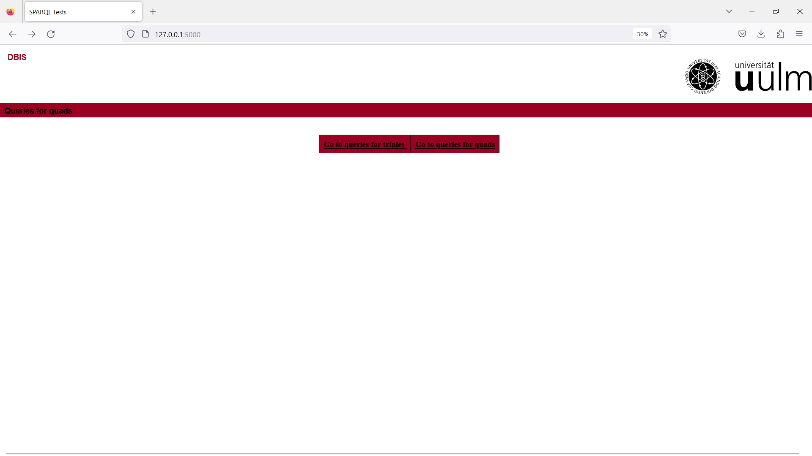
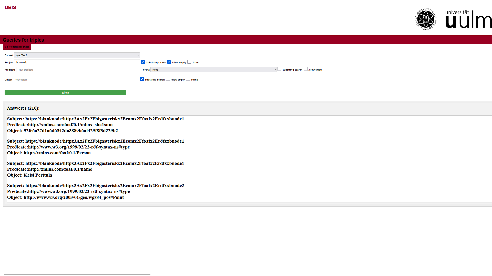
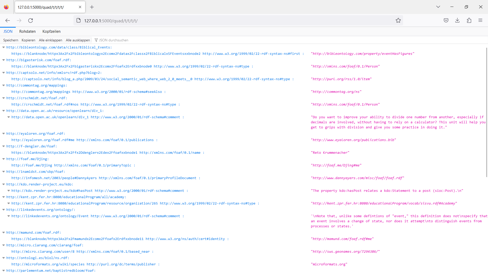

# code-inspector-and-graphs

## Getting started
These applications run on Ubuntu. If you have a Windows machine, use WSL Ubuntu. <br />

The web application is run_webGUI.py <br />
To start it, run: run_webGUI.py<br />
Install all missing packages.<br />
If you can not install berkeleydb package for python, try:<br />
$ sudo apt install libdb-dev<br />
$ pip install bsddb3<br />

## Important:
All paths have to be relative paths to the execution folder.

## Add file to Store
```console
python convertToStore.py[path/to/file]  [name]  [QuadsOrTriplets]
```
path/to/file: determines the file that is read to create the DB, e.g., converted.rdf.<br />
name: is the name you want to name your DB. The name has to be unique; otherwise, you get "Name already taken!".<br />
QuadsOrTriplets: 4 for Quads and 3 for Triplets. Other values result in not saving it in the file for DBs.

## Create a summary
The file is in Summarization.
```console
python summary.py [path/to/file]
```
path/to/file: determines the file that is read to create the summary, e.g., converted.rdf.
It also creates the DBs of the summaries.

## Homepage

## Datasets (different summaries + original)

## Search

## Query Representation in JSON

